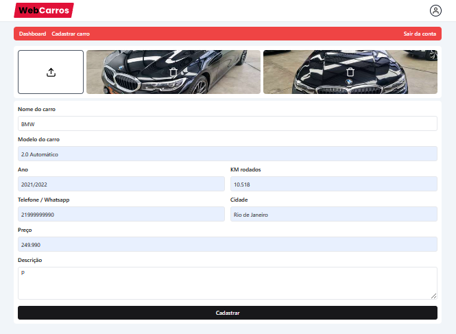
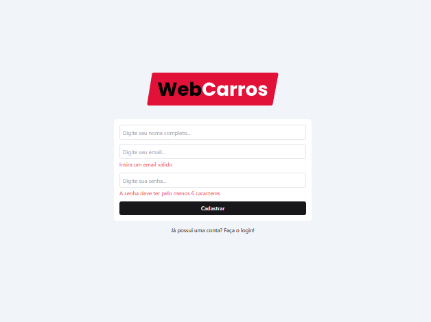
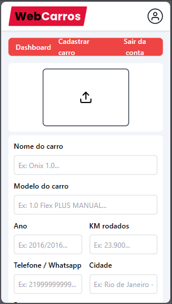
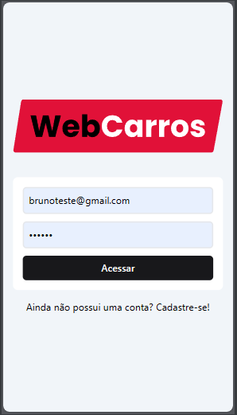

<hr>

### Tópicos

- [Descrição do projeto](#descrição-do-projeto)

- [Funcionalidades](#funcionalidades)

- [Layout](#layout)

- [Ferramentas utilizadas](#ferramentas-utilizadas)

- [Acesso ao projeto](#acesso-ao-projeto)

- [Abrir e rodar o projeto](#abrir-e-rodar-o-projeto)

- [Desenvolvedor](#desenvolvedor)

## Descrição do projeto

<p align="justify">
 Projeto desenvolvido para a venda de automóveis, onde o usuário mediante a um cadastro e login, pode cadastrar seu veículo, com dados, imagens e seu contato. Ao cadastrar, seu veículo é exposto na página principal com seus dados.
  


</p>

## Funcionalidades

:heavy_check_mark: `Funcionalidade 1:` Site para venda de automóveis.

:heavy_check_mark: `Funcionalidade 2:` Login e logout do usuário e proteção de rota.

:heavy_check_mark: `Funcionalidade 3:` Formulário para inserir dados e imagens dos veículos.

:heavy_check_mark: `Funcionalidade 4:` Página de detalhes dos veículos com imagens expostas em slide.

## Layout

<div align="center">




### Layout Responsivo



  </div>

###

## Ferramentas utilizadas

       

- React
- TypeScript
- JavaScript
- Firebase
- HTML
- Git
- TailwindCSS

🎈 <i><b>OBS:</b></i> Foi utilizado o Firebase porque traz a estrutura de login e armazenamento de dados no banco sem a necessidade de implementar algo mais complexo.
       O uso do TailwindCSS se justifica por ser um projeto de estudos, facilitando sua estilização e tornando mais ágil o processo, visto que não é uma aplicação grande e complexa.


###

## Acesso ao projeto

Você pode [acessar o site do projeto](https://web-car-phi.vercel.app/login).

## Abrir e rodar o projeto

```cmd
# Clone este repositório
git clone <link do repositório>

# Acesse a pasta do projeto no seu terminal
cd <nome do projeto>

# Instalar dependências
npm install

# Execute a aplicação
npm run dev
```

## Desenvolvedor

[<br><sub>Bruno Dias de Freitas</sub>](https://www.linkedin.com/in/brunodias-dev)
